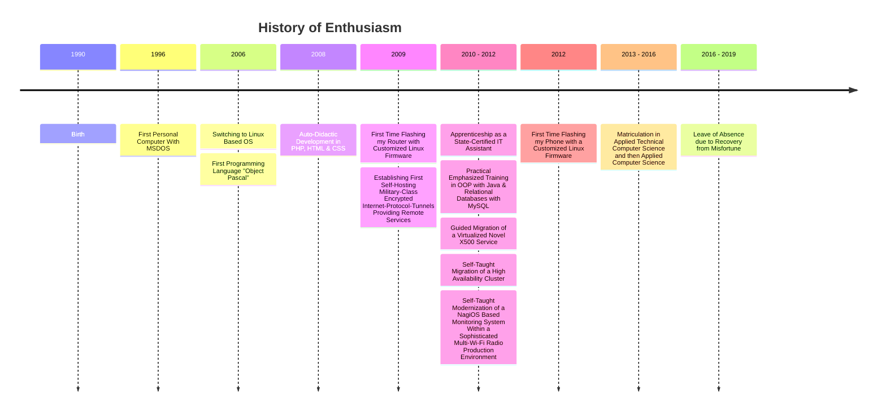

+++
title = "Über mich"
date = 2025-07-12T11:48:00Z
updated =  2025-07-15T12:15:00Z
description = "Myself"
weight = 0
draft = false
render = true
aliases = []
authors = ["Michael Fröhlich"]
in_search_index = true
#slug = "myself"
#path = "aboutme/myself" 
template = "page.html"
[taxonomies]
categories = ["about"]
tags = ["me"]
[extra]
subtitle = "About me"
disable_toc = false
+++

I'm Michael, a Rhineland based auto-didactic IT generalist.

## As IT system administrator well experienced in
- analyzing and reverse-engineering complex IT environments 
- providing, migrating and enhancing IT infrastructures, including:  
	- writing department specific domain policies
	- orchestrating customized services (on-premises)
	- (semi-/)automating and solving cost-expensive IT workarounds including reproducible system failures
	- modernizing and streamlining legacy workflows in over decades-grown environments

## Theoretical expertise in
 - Operating System Concepts
 - Relational Databases
 - Computer Networks & Distributed Systems
 - Theory of Computation & Formal Methods
 - Computer Architecture & Organization
 - Fundamentals of Low-Level & High-Level Software Development in
	- Assembler
	- C++
	- Python
	- Java
	- SQL

## Practical and self-taught experiences in
 - Computer Languages
	 - Bash
	 - Powershell
	 - CMD (BATCH)
	 - CSS/HTML
	 - PHP
	 - Ansible
 - Software Packaging, Deployment Issues & Concepts
 - Operating System Customization & Deployment of OS-Derivatives Based Upon 
	 - Unix Kernels 
	 - Linux Kernels
	 - Windows-NT Kernels 
 - Virtualization & Sandboxing
	 - VMWare's vSphere
	 - Oracle's Virtualbox
	 - Docker
	 - Flatpaks
	 - Nix Derivations
 - Documentation and Massive Note-Taking in Obsidian 
	 - Nearly Zettelkasten-Compliant
	 - Documentation of IT Knowledge & Practices
		 - \>1.000 Notes Written

## 2024-2025 Training Courses: Agile Software Developer

Complementing my senior expertise in system migrations by attending full-time courses in 
 - Project Management
 - Professional Scrum Master
 - Business English
 - Python
 - Java
 - C++

## 2019-2024: IT coordinator at a metropolitan medical diagnostics center

Self‑reliantly, I revolutionized the diagnosis center’s heavily customized and decades-grown IT infrastructure by 

identifying the common and individual properties of every system, system cluster, and system class. Then backing up and rebuilding or hardening each one individually while adhering to regulatory security policies.  

<strong>✅ The transformation resulted in a significantly higher level of automation, increased availability of core services, and improved long‑term stability while keeping expenses affordable.</strong>
 

## 1996-2019 Digital Native

<pre class="mermaid">
	timeline
		title History of Enthusiasm
		1990 : Birth
		1996 : First Personal Computer With MSDOS
		2006 : Switching to Linux Based OS
		: First Programming Language "Object Pascal"
		2008 : Auto-Didactic Development in PHP, HTML & CSS
		2009 : First Time Flashing my Router with Customized Linux Firmware
		: Establishing First Self-Hosting Military-Class Encrypted Internet-Protocol-Tunnels Providing Remote Services
		2010 - 2012 : Apprenticeship as a State-Certified IT Assistant
		: Practical Emphasized Training in OOP with Java & Relational Databases with MySQL
		: Guided Migration of a Virtualized Novel X500 Service
		: Self-Taught Migration of a High Availability Cluster
		: Self-Taught Modernization of a NagiOS Based Monitoring System Within a Sophisticated Multi-Wi-Fi Radio Production Environment
		2012 : First Time Flashing my Phone with a Customized Linux Firmware
		2013 - 2016 : Matriculation in Applied Technical Computer Science and then Applied Computer Science
		2016 - 2019 : Leave of Absence due to Recovery from Misfortune
</pre>

